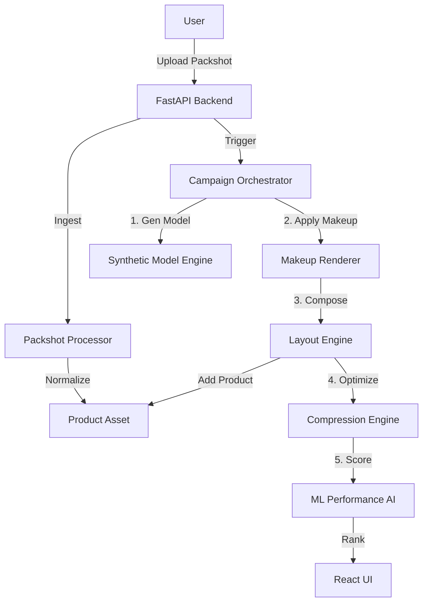

# Tesco AI Beauty Try-On Creative Engine (TABCE) 💄✨

> **Retail Media Creative Tool Hackathon Submission**  
> *Transforming beauty ad production with Generative AI and Computer Vision.*

TABCE is an end-to-end AI platform that automates the creation of hyper-personalized, brand-compliant beauty creatives for Tesco Retail Media. It generates realistic diverse models, applies virtual makeup, composes layouts, and predicts performance—all from a single product packshot.

---

## 🚀 Features

*   **Synthetic Model Generation**: Create diverse models (Ethnicity, Age, Skin Tone) from a single base mesh.
*   **Virtual Makeup Engine**: Apply Parametric Makeup (Lipstick, Blush, Eyeliner) with cultural presets (Indian, Western, Asian, Arabic).
*   **Creative Composer**: Auto-generate layouts for Web, App, and Social formats with Tesco branding (Clubcard prices, fonts).
*   **Performance AI**: Predict CTR and visual appeal using extracted features (Contrast, Vibrancy).
*   **Safety First**: Built-in safeguards against unauthorized face cloning and mandatory consent flows.
*   **Optimization**: Automatic image compression (<500KB) and SSIM quality checks.

---

## 🛠️ Architecture

The system follows a modular pipeline architecture controlled by a Python orchestrator.



### Tech Stack
*   **Frontend**: Next.js 14, TailwindCSS, Framer Motion (Glassmorphism UI).
*   **Backend**: FastAPI (Python), Uvicorn.
*   **Core Engine**:
    *   **CV**: OpenCV, MediaPipe (Face Mesh), Pillow (Image Processing).
    *   **ML**: Scikit-Learn (Random Forest Predictor), Rembg (Background Removal).
    *   **Optimization**: Scikit-Image (SSIM).

---

## 🏁 Quick Start

### Prerequisites
*   Python 3.9+
*   Node.js 18+

### One-Click Demo (Windows)
We provide a script to seed data, run the generation pipeline, and package the results automatically.
1.  Open terminal in `tabce` directory.
2.  Run `scripts\demo.bat`
3.  Open `demo_results.zip` to see the generated assets.

### Manual Setup (Development)

**1. Backend**
```bash
cd tabce
pip install -r backend/requirements.txt
uvicorn backend.main:app --reload
# API running at http://localhost:8000
# Docs at http://localhost:8000/docs
```

**2. Frontend**
```bash
cd tabce/dashboard
npm install
npm run dev
# Dashboard running at http://localhost:3000
```

---

## 📚 Module Documentation

See `/docs` for detailed breakdowns:
*   [**Architecture Deep Dive**](docs/architecture.md): Data flow and component details.
*   [**API Reference**](docs/api.md): Endpoint definitions.

---

## 🛡️ Safety & Ethics
TABCE is designed with **Responsible AI** principles:
1.  **Anti-Cloning**: The system scans uploaded packshots for human faces. If a face is detected, the upload is rejected to prevent unauthorized synthesis of real people.
2.  **Consent**: Explicit user consent is required for all uploads.
3.  **Diversity**: The model generator is hardcoded to produce equal variances of ethnicities (Light, Tan, Deep, Warm) to ensure inclusive advertising.

---

## 📄 License
MIT License. See `LICENSE` file.
